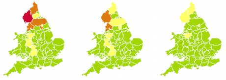

# FloodMonitoring 
[](https://jitpack.io/#fiskurgit/FloodMonitoring) [](https://travis-ci.org/fiskurgit/FloodMonitoring) [](https://codecov.io/github/fiskurgit/FloodMonitoring?branch=master)

Android library for the gov.uk Flood Monitoring API: http://environment.data.gov.uk/flood-monitoring/doc/reference

The Flood Monitoring API is RESTful and follows [HATEOAS](https://en.wikipedia.org/wiki/HATEOAS), this means where the Android library requires a url you can use the id of an object: `getId()`

A couple of apps using this library:  
Flood Alerts: https://play.google.com/store/apps/details?id=eu.fiskur.floodmonitor  
River Levels: https://play.google.com/store/apps/details?id=eu.fiskur.riverlevels

The library uses RxJava, example usage:

```java
FloodMonitoring.getInstance().getThreeDayForecast()
	.observeOn(AndroidSchedulers.mainThread())
	.subscribeOn(Schedulers.newThread())
	.subscribe(new Observer<ThreeDayForecast>() {
	    @Override
	    public void onCompleted() {
	    }

	    @Override
	    public void onError(Throwable e) {
	        //...
	    }

	    @Override
	    public void onNext(ThreeDayForecast threeDayForecast) {
	        outputForecast(threeDayForecast);
	    }
	});
```
#Dependency

Add jitpack.io to your root build.gradle, eg:

```groovy
allprojects {
    repositories {
        jcenter()
        maven { url "https://jitpack.io" }
    }
}
```

then add the dependency to your project build.gradle:

```groovy
dependencies {
    compile fileTree(dir: 'libs', include: ['*.jar'])
    compile 'com.github.fiskurgit:FloodMonitoring:1.5'
}
```
You can find the latest version in the releases tab above: https://github.com/fiskurgit/FloodMonitoring/releases

More options at jitpack.io: https://jitpack.io/#fiskurgit/FloodMonitoring

#Licence

Full licence here: https://github.com/fiskurgit/FloodMonitoring/blob/master/LICENSE.md

In short:

> The MIT License is a permissive license that is short and to the point. It lets people do anything they want with your code as long as they provide attribution back to you and don’t hold you liable.

#Logging

You can turn on logging to see the network response:

`FloodMonitoring.getInstance().logOutput(true);`

Then register a log listener:

```java        
FloodApiLogger.getInstance().setApiLogListener(new FloodApiLogger.ApiLogListener() {
    @Override
    public void apiLog(String message) {
        Log.d(TAG, message);
    }
});
```

#3 Day Forecast



`getThreeDayForecast()` returns a general overview of the forecast for England and Wales over the next 3 days. A small image of the UK marked with forecast warnings can be fetched using `getDayImageBytes(int day)` (with 1, 2, or 3) this returns a Retrofit `ResponseBody` containing the image bytes, a convenience method in the utils class helps populate an ImageView: `FloodUtils.loadImage(responseBody, imageView)`. Alternatively get the image URLs for use with [Picasso](http://square.github.io/picasso/) or similar: `getDayImageUrl(int day)`.

#Flood Warnings

`getAllWarnings()` returns `List<FloodWarning>` of all current alerts (including any that have been removed in the last 24 hours, use `getSeverityLevel()` to build your UI).

`getAreaWarnings(double latitude, double longitude, int distance)` returns `List<FloodWarning>` of any flood alerts in the area.

`getFloodAreaFromUrl(String url)` returns the `FloodArea` including latitude and longitude for plotting warning locations on a map.

#Water Level Stations

`getAreaStations(double latitude, double longitude, int distance)` returns `List<StationOverview>` containing some detail, but you should use the `id` to fetch the full `StationDetail` object: `getStation(String url)`.

`getReadings(String url, int count)` gets the last `count` `Reading` objects, normally taken at 15 minute intervals that you can use to create graphs, you can also use `getReadingsToday(String url)` and `getReadingsDays(String url, int days)` which will ge the last x days worth of readings (although the API docs state data is held for a month it only seems to return up to two weeks worth of readings).
